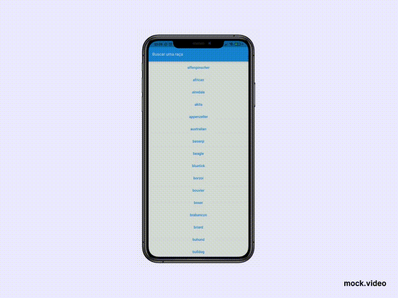

# Flutter Dogs
⭐ This is a app developed in Flutter, using Object Oriented Programing, Modular Programming, MobX, SOLID, Inversion of Control, Dependency Inversion and TDD⭐ 

## The App



## Configuration Steps

Cloning the repository:
```
$ git clone https://github.com/williamtdepaula/flutter_dogs
```

Open the project:
```
$ cd flutter_dogs
```

Now run the app on your connected device (using terminal):
```
$ flutter run
```

## 🤓 Author(s)

**William Tristão de Paula**  [Profile](https://github.com/williamtdepaula "GitHub Profile")
